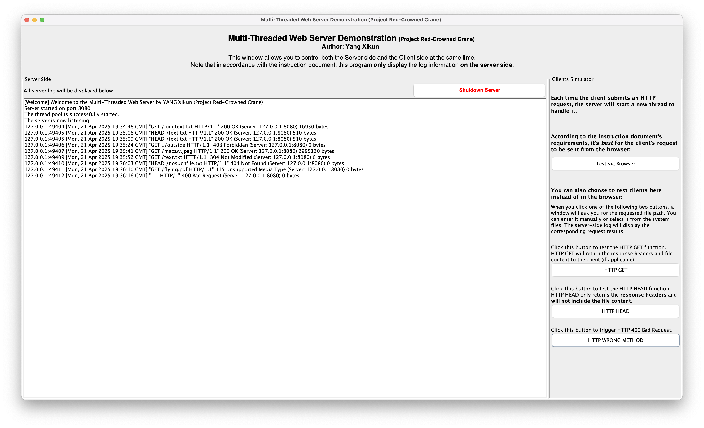
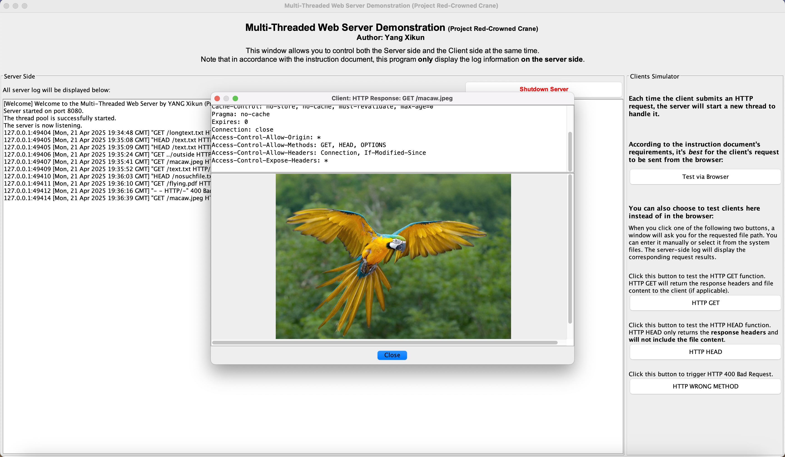
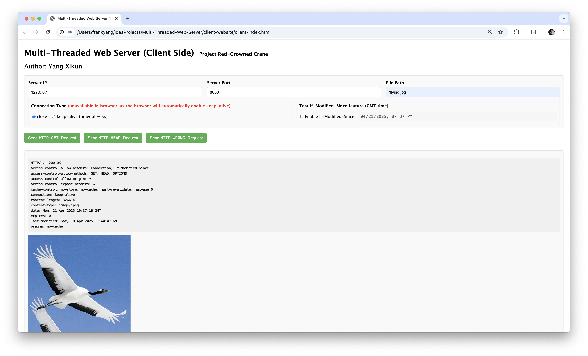

# Multi-Threaded Web Server - A Computer Networking Individual Project
#### Yang Xikun, Apr 2025, revised Sept 2025

    
    
    

## Overview of implemented features
- A **Multi-Threaded Web Server** is implemented using Java.
- The Server includes GUI windows. Its main window is called the **Main Window**.
- The main part of the Main Window is the Server's **log area**. 
- A small part on the right side of the Main Screen is the **Clients Simulator**, where you can communicate with the Server via socket without opening a browser. The Clients Simulator is designed for a better socket communication experience.
- You can also use the **Client Website** to act entirely as a Client, sending requests to the Server and receiving responses through sockets.
- Whenever, the Server and Clients are strictly independent. **Communication between them relies solely on sockets.**
- The Server supports **multithreading**. When the socket receives a new request from a Client, it will create a new process to handle it.
- This program uses the Socket classes and implements request and response handling on its own, **without using any encapsulated HTTP classes**.
- Please refer to `report.pdf` or `report-publish.pdf`, which contains all the implemented features and technical details.
- This program meets all the requirements stated in the instruction document.

## Please check if all files are complete
This project folder should include the following files/folders:
- `README.md` - This file
- `WebServerApp.jar` - The compiled `.jar` file of the Web Server. You can use the `java jar` command to directly run this file to open the Web Server. See the section **How to Run** below.
- `src/` - Folder containing the Java source code for the web server
- `client-website/` - Folder containing the HTML-CSS-JavaScript source code for the client website
- `resources/` - Root directory of web server resources, containing some test resource files
- `logs/` - Complete log files for two _Complete Journeys_ (see report), where `log/log-complete-journey-I.txt` includes all the functionalities of this Web Server.
- `report.pdf` or `report-publish.pdf` - The project report

## How to run

### Install Java 16 or later
The Web Server is written in **Java 16**, specifically, **Java 16.0.2**. If your device does not have Java 16 (or later) installed or has an outdated version, please download and install it first. You can download Java 16 from [here](https://www.oracle.com/java/technologies/javase/jdk16-archive-downloads.html). You can also download the latest version of Java from [here](https://www.oracle.com/hk/java/technologies/downloads/). **If you are using PolyU Lab computers, Java 17 or Java 18 should be pre-installed, and you do not need to install Java 16 again.**

### Run this program

#### Server: Run the `.jar` compiled file (Recommended)
- You can run the Web Server directly using the `java -jar` command.
- Please first use `git clone` to clone the entire repo (or as a project evaluator, unzip the entire package I submitted), then use `cd` to enter the folder.
- Please use the command line tool, run `java -jar WebServerApp.jar` to open the Web Server. This will start the Server and display the Main Window.
- You can also simply drag the `WebServerApp.jar` file into the command line tool to run it. In that case, the command should be `java -jar <path to WebServerApp.jar>`.

#### Server: Run the source code
- Please first use `git clone` to clone the entire repo (or as a project evaluator, unzip the entire package I submitted), then open the folder using IntelliJ IDEA. 
- Then please run the `src/com/frankyang/polyu/comp2322/webserver/WebServerApp.java` class. This will start the Server and display the Main Window.

#### Client: Run the Client Website
- You just need to directly open `client-website/client-index.html`.
- You can also open it in the Server's Main Window by clicking the **Test via Browser** button on the Clients Simulator panel.

## Troubleshooting
This program has been thoroughly tested on my computer. 

If you encounter any issues (especially as a grader), it might be due to differences in devices. 

In addition, some components of the JVM have issues. They might be legacy issues or implementation flaws. This doesn't mean there is a problem with my implementation. 

I know this is frustrating, but please contact me through `frank-xikun.yang@connect.polyu.hk`.

